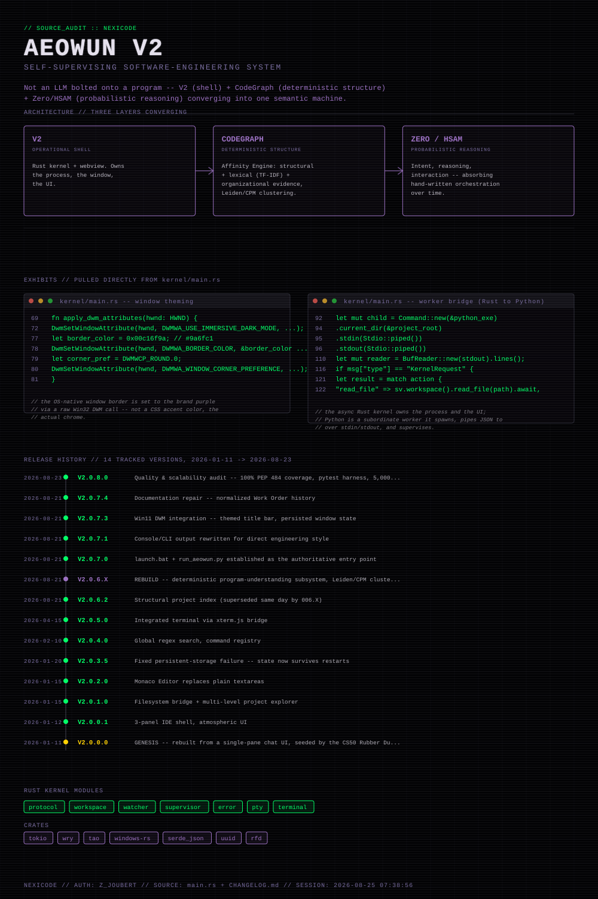

# ZACHARY JOUBERT // NEXICODE_WORKSTATION

"A mechanic gets pissed at a machine and can at least physically attack the problem: 'WHY THE FUCK ARE YOU DOING THAT?' [wrench]. Software gives you: NullPointerException and your only available wrench is a $150 keyboard."

---

## SYSTEM_DIAGNOSTIC: LIVE
I build standalone engineering tools that solve the problems I actually run into. 
Open Source prototypes are FREE to use, I build things I love to use, and would LOVE to see other people start building things too!
Ill start rolling them all out one by one as I go through testing them, all projects will be available here on Git-Hub.

### Build it. Break it. Understand why.
I don't believe in trusting blindly. I try to build systems that track their own state, own the workspace, and demand physical evidence before it can claim a task is complete.

---

## THE_TOOLBOX

- **[AEOWUN](https://github.com/joubertzack-web/Aeowun)**: A custom IDE shell. It manages a Rust-based PTY supervisor and a Cytoscape-backed knowledge graph to stop AI loops before they start.
- **[DROP (Aeopin)](https://github.com/joubertzack-web/Aeopin)**: A native Windows capture engine. It uses an atomic "Copy-Verify-Delete" protocol with SHA-256 integrity to ensure you never lose a file.
- **[AXEIS](https://github.com/joubertzack-web/AXEIS)**: Adversarial research software. It forces every conclusion to have a traceable "Evidence Path" and subjects every hypothesis to a mandatory Kill Phase.
- **[LANGO](https://github.com/joubertzack-web/Lango)**: A concept-transfer simulator. It normalizes code logic into a language-neutral IR so you can skip the "Variables 101" fluff when picking up a new stack.

---

[Portfolio](https://joubertzack-web.github.io/portfolio/) // [The Network](https://github.com/joubertzack-web/NETWORK)
